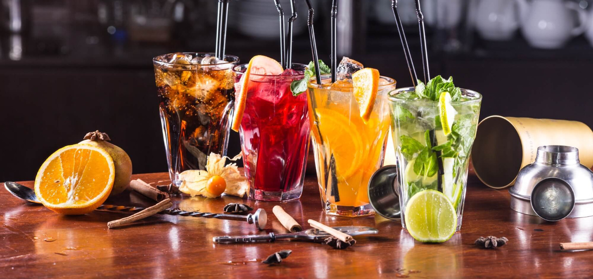
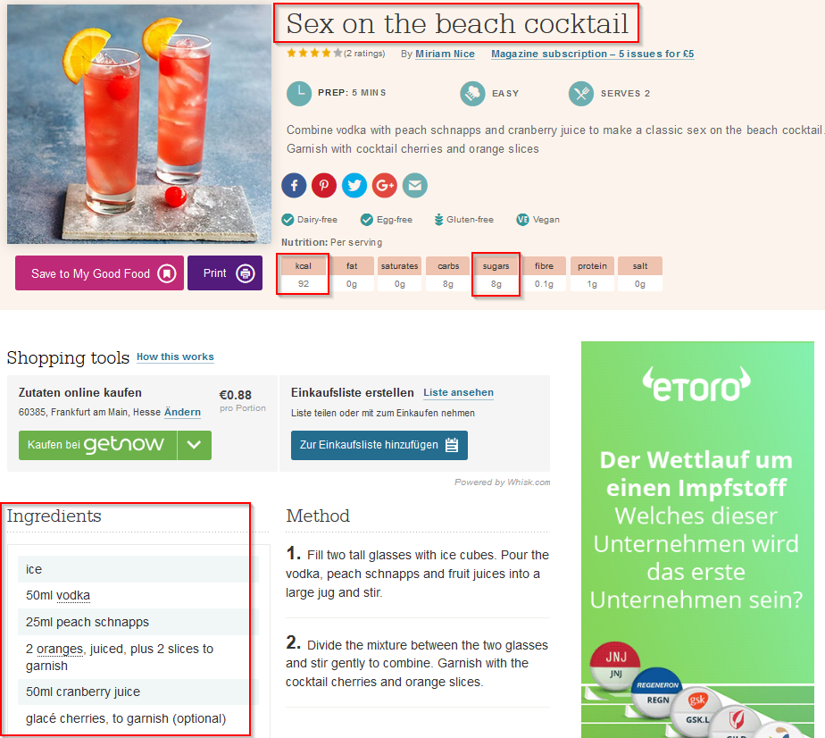
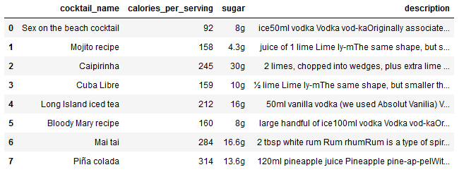

# Data Scraping with Beautiful Soup

+ [Table of Contents](#sub-sub-heading-1)
   + [Credits](#credits)
   + [Project Goal and procedure](#project-goal-and-procedure)
   + [Code and Resources](#code-and-resources)
   + [Scraping Data using Beautiful Soup](#scraping-data-using-beautiful-soup)

 

### Credits: 
A big thank you goes to [KenJee](https://www.youtube.com/channel/UCiT9RITQ9PW6BhXK0y2jaeg), [Codebasics](https://www.youtube.com/channel/UCh9nVJoWXmFb7sLApWGcLPQ), [Krish Naik](https://www.youtube.com/user/krishnaik06), [Keith Galli](https://www.youtube.com/channel/UCq6XkhO5SZ66N04IcPbqNcw)  and to the whole [Edureka Team](https://www.youtube.com/user/edurekaIN) who put a lot of effort to teach people Data Science,Machine Learning, Statistics and a lot of other related topics for free.

### Project Goal and Procedure
* Goal: Build a Logistic Regression Model to predict Cocktails based on selected ingredients
* Scraped cocktail information from [www.bbcgoodfood.com](https://www.bbcgoodfood.com/)  
* Dataset was scraped using Python and BeautifulSoup
* Saved results in a csv file and opened with Python's pandas package

### Code and Resources
* Python Version: 3.8
* Environment: Jupyter Notebook
* Packages: Beautiful Soup, Matplotlib, Pandas
 
 

# Scraping Data using Beautiful Soup
The relevant data for the dataset was extracted by using Beautiful Soup. I wrote a script which was able to scrape the following information:
* Cocktail name
* amount of calories per serving
* amount of sugar information
* description (includes the ingredients which will be extracted in the future steps)

#### I extracted the mentioned information for each cocktail one by one and concatenated the outputs in the last step, so that the pandas dataframe looks like this:

 
 
